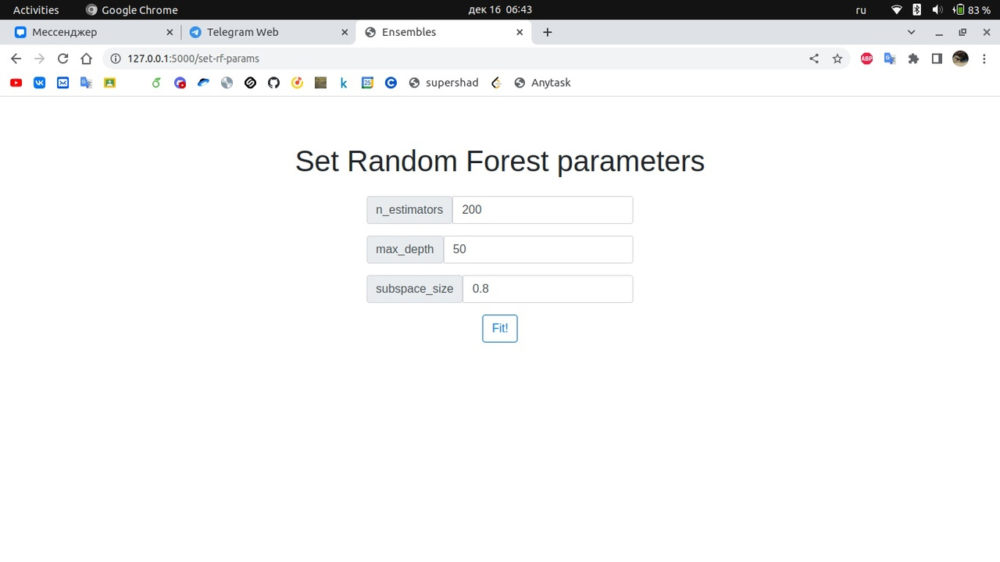
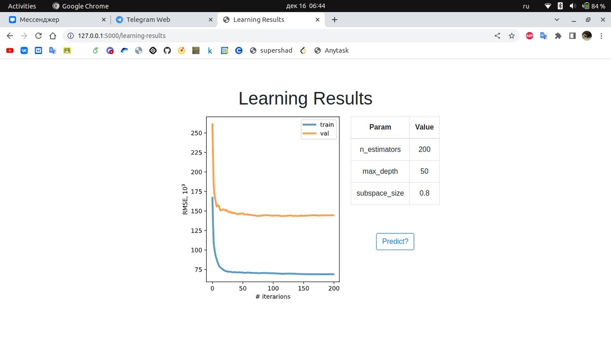
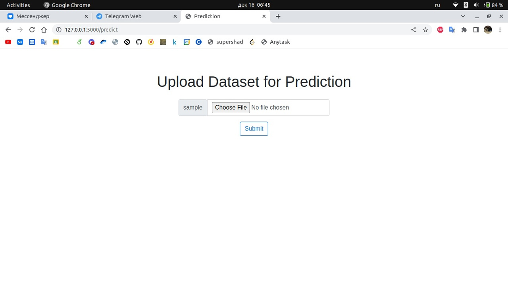
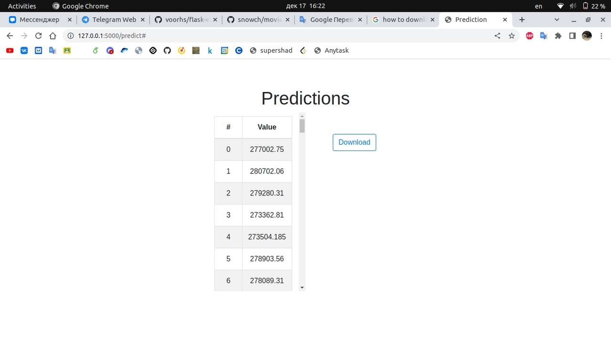

# Web Application with Random Forest and Gradient Boosting

Python-flask based web-application which provides fitting and predicting regression using Random Forest and Gradient Boosting which are implemented from scratch.

## Dependencies

- `numpy`
- `scipy`
- `flask`
- `flask_wtf`
- `wtforms`

## Functionality

### Upload dataset

You need to upload `.csv` file with dataset for training. Since my app doesn't perform data preprocessing, your dataset must contain only numerical values. Additionaly, you can upload validation dataset. You must provide name of target column.

### Choose model

### Set parameters

You can specify parameters for model chosen. Random Forest model must be provided with following parameters:

- `n_estimators`: number of trees to ensemble, integer value
- `max_depth`: limitation on max depth of tree, integer value
- `subspace_size`: fraction of features selected to train a single tree, float in `(0, 1]`.

In addition, Gradient Boosting requires `learning_rate`, positive float.

After clicking `Fit!` button you need to wait until your model is trained. It may take long time.

### Learning Results

After completing model training, learning curve for train dataset is shown (and for validation dataset, if provided). RMSE is used. 

If you want to make predictions with trained model, click on `Predict?` button.

### Upload Prediction Dataset

You need to upload `.csv` file with dataset for prediction. It must have all columns named as in training datasets and not contain target column.

After clicking `Predict` button you need to wait until predictions are made. It may take long time.

### Prediction Results

After making prediction, it is shown in scrollable table. You can download it as `.csv` file.

